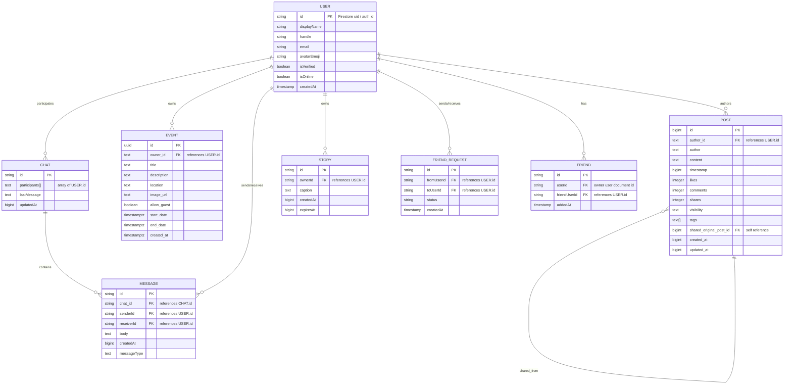

# ER Diagram (Mermaid)

Below is an ER diagram summarizing the app's main data entities (Supabase tables + Firestore collections) and their relationships.

If you'd like, I can:
- generate a PNG/SVG export of this Mermaid diagram and add it to the repo
- refine entity attributes or add more entities (groups, notifications, profiles)
